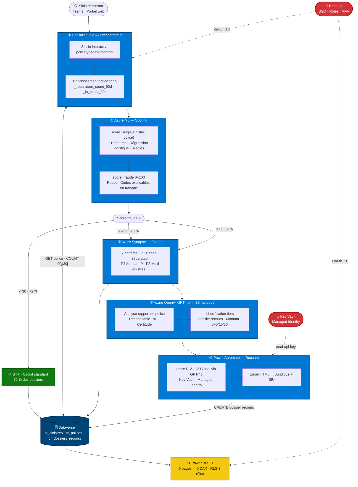

<div align="center">

# Agent IA — Détection Fraude & Recours Automatique

**Pipeline agentique multi-étapes sur stack Microsoft Azure**
pour les assureurs IARD français

<br/>

[](https://python.org)
[](https://scikit-learn.org)
[](https://azure.microsoft.com/fr-fr/products/machine-learning)
[](https://azure.microsoft.com/fr-fr/products/ai-services/openai-service)
[](https://azure.microsoft.com/fr-fr/products/synapse-analytics)
[](https://www.microsoft.com/fr-fr/microsoft-copilot/microsoft-copilot-studio)
[](https://powerautomate.microsoft.com)
[](https://powerbi.microsoft.com)
[](https://powerplatform.microsoft.com/fr-fr/dataverse/)
[](https://mermaid.js.org)
[](LICENSE)
[](https://fraud.tkoidra.com)

<br/>

**[→ Démo interactive du pipeline](https://fraud.tkoidra.com)**

<br/>

*Portfolio de compétences en IA agentique Microsoft — Sébastien Donné*
**[tkoidra.com](https://tkoidra.com)** · [sebastien@tkoidra.com](mailto:sebastien@tkoidra.com)

</div>

---

## Le problème

Les équipes fraude des assureurs IARD font face à deux inefficacités structurelles :

| Problème | Impact |
|---|---|
| **~80 % de faux positifs** dans les alertes fraude basées sur des règles fixes | Les investigateurs SIU passent leur temps sur des dossiers légitimes |
| **Recours en subrogation non systématisés** | Identification manuelle 2–3 semaines après sinistre, souvent oubliée |

Les montages frauduleux en réseau — même garagiste, même IP, déclarations groupées — sont invisibles sans croisement inter-dossiers. Et chaque jour sans recours initié réduit les chances de récupération.

---

## La solution

Un **pipeline agentique à 5 étages** qui traite chaque sinistre entrant de la déclaration à la lettre de recours, sans intervention humaine sur les cas évidents, en libérant les experts SIU pour les dossiers qui méritent vraiment leur attention.

```
Sinistre entrant (Teams / Portail)
         │
         ▼
  ① Copilot Studio ──→ saisie + enrichissement Dataverse
         │
         ▼
  ② Azure ML ──────→ score_fraude 0–100 + Reason Codes
         │
    ┌────┴──────────────┐
    │                   │
score < 30           score ≥ 30
    │                   │
    ▼                   ▼
✅  STP          ③ Azure Synapse ──→ analyse réseau (7 patterns)
 72% des               │
 dossiers              ▼
                ④ Azure OpenAI ──→ lecture rapport police
                       │
                  ┌────┴────┐
               Fraude    Recours
                  │         │
                  ▼         ▼
             SIU + PBI  ⑤ Power Automate ──→ email juridique < 1h
```

> Toutes les données restent dans votre **tenant Azure**. Aucune dépendance à des APIs tierces hors écosystème Microsoft.

---

## Architecture complète



> **Diagrammes complémentaires** (flux de données, séquence temporelle, infrastructure Azure) : [`docs/architecture-diagram.md`](docs/architecture-diagram.md)

---

## KPIs avant / après

| Métrique | Avant | Après | Gain |
|---|---|---|---|
| Faux positifs parmi les alertes | ~80 % | **< 20 %** | −60 pts |
| Hit rate investigation SIU | 1 fraude / 5 alertes | **3+ fraudes / 5 alertes** | ×3 |
| Délai identification recours | 2–3 semaines (manuel) | **< 1 heure (automatique)** | −95 % |
| Charge SIU sur petits dossiers | 60 % du temps | **< 15 % du temps** | −45 pts |

Sur ce jeu de démonstration (50 sinistres, 437 k€) :

- **72 %** des dossiers traités en STP automatique — zéro intervention humaine
- **5 dossiers** avec rapport de police → recours initiés automatiquement → **27 520 € récupérables**
- **Réseau REP-007** : 9 sinistres liés détectés par Synapse, invisibles en analyse unitaire
- **Score le plus élevé** : 63/100 — sinistre déclaré 10 jours après souscription, 10 362 €

---

## Ce projet démontre

| Compétence | Implémentation |
|---|---|
| **IA agentique** | Pipeline à 5 agents coordonnés, chacun spécialisé |
| **Azure Machine Learning** | Scoring hybride règles + ML, endpoint managé, artefacts versionés |
| **Azure Synapse Analytics** | Détection de réseaux par graphes T-SQL, 7 patterns, 3 vues |
| **Azure OpenAI GPT-4o** | Analyse sémantique juridique, prompts versionnés, JSON structuré |
| **Copilot Studio** | Agent orchestrateur multi-canal, entités personnalisées, RLS |
| **Power Automate** | Flow de subrogation bout-en-bout, Key Vault, Managed Identity |
| **Power BI** | Dashboard SIU 6 pages, 40 mesures DAX, RLS 3 rôles, alertes |
| **Microsoft Dataverse** | Schéma métier assurance, flux inter-agents, audit trail |
| **Sécurité Azure** | Entra ID SSO, Key Vault Managed Identity, zéro secret hardcodé |

---

## Structure du repo

```
fraud-agent-demo/
│
├── 📄 README.md                          ← ce fichier
├── 📄 CLAUDE.md                          ← instructions projet pour Claude Code
│
├── 📁 data-mock/                         ← données fictives IARD (jamais de vraies données)
│   ├── sinistres_mock.json               ← 50 sinistres avec 8 patterns frauduleux
│   ├── polices_mock.json                 ← 50 contrats associés (franchise, plafond)
│   ├── rapports_police_mock.txt          ← 5 PV de police (accidents auto, tiers 100 %)
│   ├── scores_output.json                ← sorties du modèle ML (généré par --mode score)
│   └── test_prompts_output.json          ← sorties des prompts OpenAI (généré par test)
│
├── 📁 agents/
│   ├── 📁 copilot-studio/
│   │   └── agent-config.json             ← config Agent 1 : 11 topics, 8 actions, 5 entités
│   ├── 📁 azure-ml/
│   │   ├── scoring-model.py              ← Agent 2 : entraînement + score_single() + batch
│   │   ├── features.md                   ← 11 features ML documentées, barème règles
│   │   └── model_artifacts/              ← artefacts entraînés (fraud_pipeline.joblib…)
│   ├── 📁 synapse/
│   │   └── graph-query.sql               ← Agent 3 : 628 lignes T-SQL, 23 CTEs, 7 patterns
│   └── 📁 openai/
│       └── prompts/
│           ├── analyse-rapport-police.md ← Agent 4a : prompt analyse PV, sortie JSON
│           └── identification-tiers.md   ← Agent 4b : prompt recours, art. L121-12
│
├── 📁 power-automate/
│   └── flow-recours.json                 ← Agent 5 : 20 actions, Key Vault, email HTML
│
├── 📁 power-bi/
│   └── dashboard-siu-spec.md             ← spec dashboard : 6 pages, 40 DAX, RLS
│
├── 📁 docs/
│   ├── architecture-diagram.md           ← 4 diagrammes Mermaid + ASCII art
│   └── demo-script.md                    ← script 45 min : accroche, démo, 15 Q&R
│
└── 📁 scripts/
    ├── generate-mock-data.py             ← génère data-mock/ (seed 42, reproductible)
    └── test-openai-prompts.py            ← teste les prompts OpenAI sur les 5 rapports
```

---

## Lancer la démo en local

### Prérequis

- Python 3.10+
- `pip install scikit-learn pandas numpy joblib anthropic`
- (Optionnel) `ANTHROPIC_API_KEY` pour le test des prompts OpenAI

### 1 — Générer les données mock

```bash
python scripts/generate-mock-data.py
# Crée : data-mock/sinistres_mock.json, polices_mock.json, rapports_police_mock.txt
```

### 2 — Entraîner le modèle de scoring

```bash
python agents/azure-ml/scoring-model.py --mode train
# Crée : agents/azure-ml/model_artifacts/fraud_pipeline.joblib
# Affiche : ROC-AUC entraînement + validation croisée 5-fold
```

### 3 — Scorer les 50 sinistres

```bash
python agents/azure-ml/scoring-model.py --mode score --output data-mock/scores_output.json
# Crée : data-mock/scores_output.json
# Affiche : distribution Faible/Moyen/Élevé + top reason codes
```

### 4 — Tester les prompts OpenAI sur les rapports de police

```bash
export ANTHROPIC_API_KEY=sk-ant-...
python scripts/test-openai-prompts.py
# Analyse les 5 rapports de police mock
# Crée : data-mock/test_prompts_output.json
# Affiche : nb recours viables + montant total récupérable
```

### Résultats attendus

```
Distribution des scores :
  Faible  (< 30)  : 36 dossiers  72%  → STP automatique
  Moyen   (30–59) : 13 dossiers  26%  → investigation
  Élevé   (≥ 60)  :  1 dossier    2%  → alerte SIU

Top reason codes :
  Réseau réparateur (REP-007) : 13 occurrences
  Déclaration précoce < 30j   :  4 occurrences
  Anneau IP 185.23.14.77      :  1 occurrence

Prompts OpenAI :
  5/5 dossiers avec recours viable
  Montant total récupérable : 27 520 €
```

---

## Stack détaillée

| Composant | Service | Rôle dans le pipeline |
|---|---|---|
| Orchestration agent | **Copilot Studio** | Réception sinistres, saisie, enrichissement, routing |
| Scoring ML | **Azure Machine Learning** | Score fraude 0–100, 11 features, Reason Codes |
| Analyse réseau | **Azure Synapse Analytics** | Détection patterns inter-dossiers, graphes T-SQL |
| Analyse sémantique | **Azure OpenAI GPT-4o** | Lecture PV police, identification tiers responsable |
| Workflow recours | **Power Automate** | Génération dossier subrogation, email juridique |
| Base de données | **Microsoft Dataverse** | Stockage central, audit trail, déclencheurs agents |
| Dashboard SIU | **Power BI** | 6 pages, RLS, alertes, connexion DirectQuery Synapse |
| Authentification | **Azure AD / Entra ID** | SSO, rôles, MFA — tous les agents |
| Secrets | **Azure Key Vault** | Clés API via Managed Identity — zéro hardcoding |

---

## Contexte & contacts

Ce projet est un **démonstrateur de compétences en IA agentique Microsoft** conçu pour des assureurs IARD français.

Il illustre comment assembler les briques de la Power Platform et d'Azure AI en un pipeline métier cohérent — du formulaire de déclaration jusqu'à la lettre de recours — sans dépendance à des éditeurs tiers.

**Toutes les données sont entièrement fictives.** Aucune donnée personnelle réelle n'a été utilisée.

<div align="center">

<br/>

**Sébastien Donné**
Consultant IA agentique & Power Platform

🌐 [tkoidra.com](https://tkoidra.com) · 📧 [sebastien@tkoidra.com](mailto:sebastien@tkoidra.com)

<br/>

*Disponible pour des missions de conseil, des pilotes, et des présentations techniques.*

</div>
