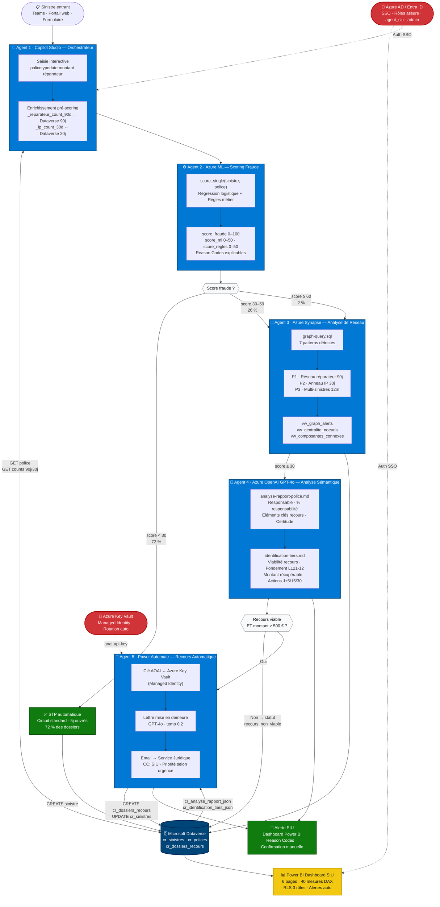
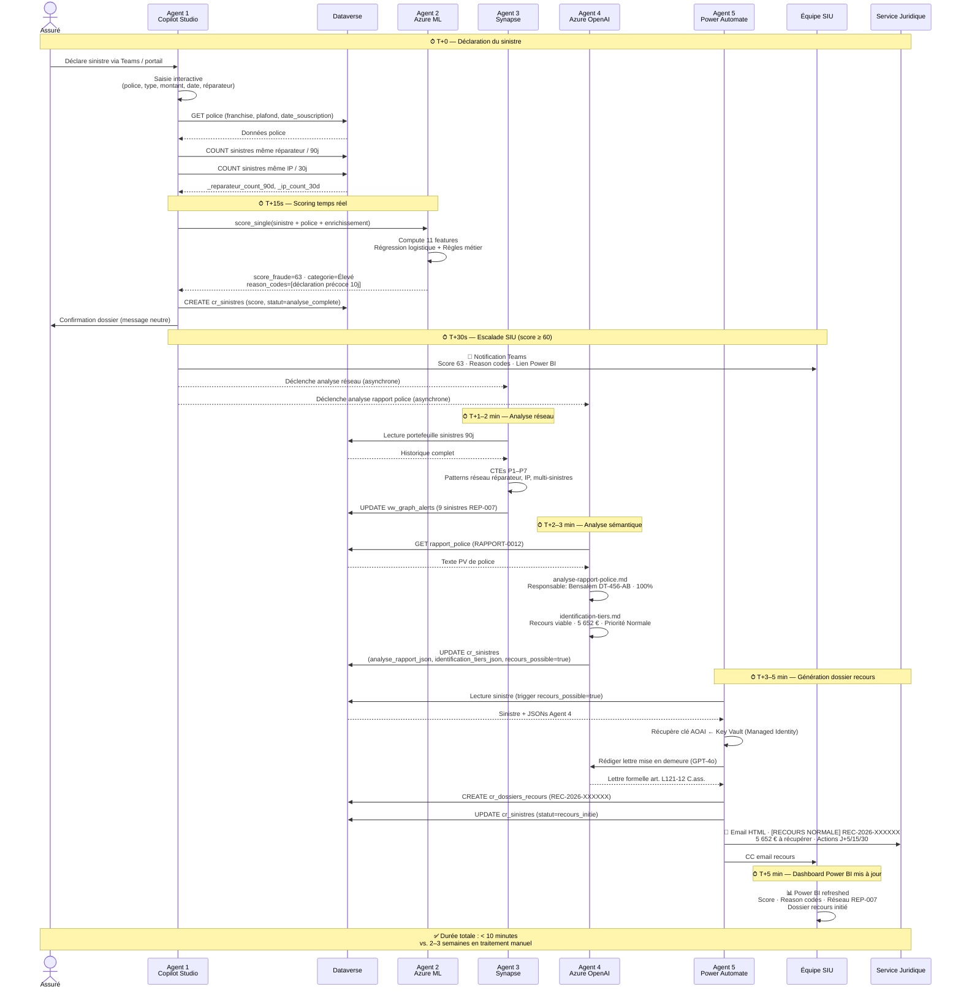
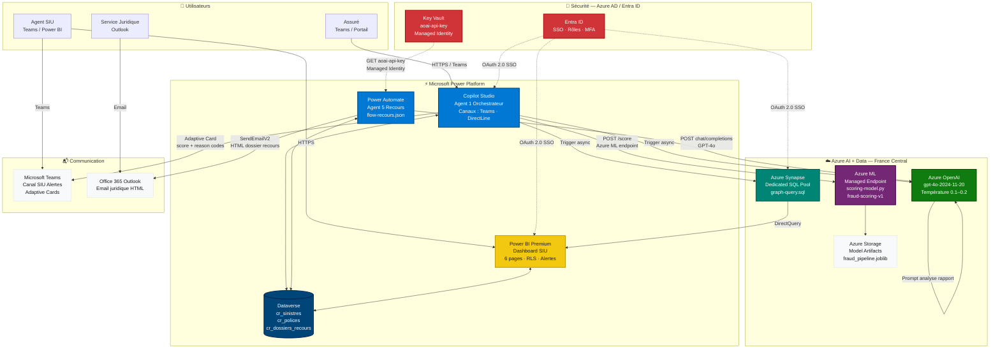

# Architecture — Agent IA Détecteur de Fraude & Recours Automatique
*fraud-agent-demo | Sébastien Donné — tkoidra.com | juin 2026*

> Ce fichier contient **4 diagrammes Mermaid** couvrant des vues complémentaires du pipeline, plus un schéma ASCII de référence rapide. Rendu natif sur GitHub, GitLab, Notion, et tout éditeur Mermaid.

---

## Diagramme 1 — Pipeline complet (vue décisionnaire)

> Vue principale destinée aux DSI et Responsables Fraude. Montre les 5 agents, les flux de données, les branchements conditionnels et les systèmes de stockage/visualisation.



---

## Diagramme 2 — Flux de données détaillé (vue technique)

> Vue pour les Directeurs Techniques. Montre précisément quelles données transitent entre chaque agent, avec les noms de champs réels et les formats.

```mermaid
flowchart LR
    %% ── Entrée ──────────────────────────────────────────────
    subgraph INPUT["Données entrantes"]
        D_SIN["sinistre\nid_sinistre · id_police\ntype · date · montant\nid_reparateur · adresse_ip"]
        D_POL["police\ndate_souscription\nfranchise · plafond_garantie\ntype_contrat"]
    end

    %% ── Enrichissement Dataverse ────────────────────────────
    subgraph ENRICH["Enrichissement Dataverse (avant scoring)"]
        E1["_reparateur_count_90d\nCOUNT sinistres\nmême id_reparateur / 90j"]
        E2["_ip_count_30d\nCOUNT sinistres\nmême adresse_ip / 30j"]
    end

    %% ── Payload score_single ────────────────────────────────
    subgraph PAYLOAD["Payload score_single — 14 champs"]
        P_SIN["sinistre dict\nid · police · type · date\nmontant · reparateur · ip\n_reparateur_count_90d\n_ip_count_30d"]
        P_POL["police dict\nid · date_souscription\nfranchise · plafond\ntype_contrat"]
    end

    %% ── Sortie Azure ML ─────────────────────────────────────
    subgraph ML_OUT["Sortie score_single — 5 champs"]
        O1["score_fraude 0–100"]
        O2["score_ml 0–50\nproba × 50"]
        O3["score_regles 0–50\nRègles IP+Rép+Précoce+Montant"]
        O4["categorie_risque\nFaible · Moyen · Élevé"]
        O5["reason_codes list\ntexte naturel FR"]
    end

    %% ── Features ML ────────────────────────────────────────
    subgraph FEATURES["11 features ML"]
        F1["days_since_subscription"]
        F2["montant_sur_plafond"]
        F3["montant_zscore"]
        F4["declaration_weekday"]
        F5["type_encoded"]
        F6["reparateur_count_90d"]
        F7["ip_count_30d"]
        F8["ip_suspicious bool"]
        F9["reparateur_suspicious bool"]
        F10["precoce_flag bool"]
        F11["franchise"]
    end

    %% ── Sortie Synapse ──────────────────────────────────────
    subgraph SYN_OUT["Vues Synapse — sorties"]
        S1["vw_graph_alerts\nid_sinistre · pattern_type\ndescription · score_lien"]
        S2["vw_centralite_noeuds\ntype_noeud · id_noeud\ndegree_centralite"]
        S3["vw_composantes_connexes\ncomposante_id · taille\nsinistres_membres"]
    end

    %% ── Sortie OpenAI ───────────────────────────────────────
    subgraph OAI_OUT["Sorties Azure OpenAI — 2 JSON"]
        A1["analyse_rapport\nreference_rapport\nparties_responsables\npart_responsabilite_pct\nelements_cles_recours\nrecours_possible\nniveau_certitude"]
        A2["identification_tiers\nrecours_viable\nfondement_juridique\nmontant_estimé_récuperable\nactions_prioritaires J+5/15/30\npriorite_recours"]
    end

    %% ── Dataverse — champs écrits ───────────────────────────
    subgraph DV_WRITE["Dataverse — champs écrits"]
        DW1["cr_sinistres\nscore_fraude · score_ml · score_regles\ncategorie_risque · reason_codes\nstatut · recours_possible\nanalyse_rapport_json\nidentification_tiers_json"]
        DW2["cr_dossiers_recours\nref_recours · tiers_nom · immat\nmontant_recuperable\nfondement_type · lettre_recours\nactions_json · date_prescription"]
    end

    %% ── Flux ────────────────────────────────────────────────
    D_SIN & D_POL --> ENRICH
    ENRICH --> PAYLOAD
    PAYLOAD --> FEATURES
    FEATURES --> ML_OUT
    ML_OUT --> SYN_OUT
    SYN_OUT --> OAI_OUT
    OAI_OUT --> A1 & A2
    A1 & A2 --> DW1
    A2 --> DW2
    DW2 -->|"cr_lettre_recours\ncr_actions_json"| EMAIL(["📧 Email juridique\nCC: SIU"])

    %% ── Styles ──────────────────────────────────────────────
    classDef group  fill:#f3f6fb,stroke:#0078d4,color:#1a1a1a
    classDef output fill:#107c10,color:#fff,stroke:#004b00
    class ML_OUT,SYN_OUT,OAI_OUT,DV_WRITE group
    class EMAIL output
```



---

## Diagramme 3 — Séquence temporelle (vue opérationnelle)

> Montre la chronologie précise d'un dossier à risque élevé, de la déclaration à l'email de recours. Utile pour la présentation des KPIs de délai.



---

## Diagramme 4 — Infrastructure Azure (vue DSI)

> Vue des services Azure utilisés, leurs interconnexions et les contrôles de sécurité. Destinée aux DSI et architectes cloud.



---

## Schéma ASCII — Référence rapide

> Version texte pour les contextes sans rendu Mermaid (email, terminal, documentation PDF).

```
╔══════════════════════════════════════════════════════════════════════════════════╗
║          PIPELINE AGENT IA — DÉTECTION FRAUDE & RECOURS AUTOMATIQUE            ║
║                     fraud-agent-demo | tkoidra.com | 2026                      ║
╚══════════════════════════════════════════════════════════════════════════════════╝

  CANAL D'ENTRÉE                           SÉCURITÉ TRANSVERSALE
  ┌──────────────────┐                     ┌──────────────────────┐
  │ Teams · Portail  │                     │  Azure AD / Entra ID │
  │ Formulaire web   │                     │  SSO · Rôles · MFA   │
  └────────┬─────────┘                     └──────────────────────┘
           │                               ┌──────────────────────┐
           ▼                               │  Azure Key Vault     │
  ┌─────────────────────────────────┐      │  Managed Identity    │
  │   AGENT 1 · COPILOT STUDIO      │      └──────────────────────┘
  │   Orchestrateur                 │
  │  ┌──────────────────────────┐   │◄────► DATAVERSE (cr_polices)
  │  │ Saisie interactive       │   │       GET franchise · plafond
  │  │ police · type · montant  │   │       date_souscription
  │  │ date · réparateur        │   │
  │  └──────────────────────────┘   │◄────► DATAVERSE (cr_sinistres)
  │  ┌──────────────────────────┐   │       COUNT réparateur / 90j
  │  │ Enrichissement           │   │       COUNT IP / 30j
  │  │ _reparateur_count_90d    │   │       → _reparateur_count_90d
  │  │ _ip_count_30d            │   │       → _ip_count_30d
  │  └──────────────────────────┘   │
  └───────────────┬─────────────────┘
                  │  Payload : sinistre (9 champs) + police (5 champs)
                  ▼
  ┌─────────────────────────────────┐
  │   AGENT 2 · AZURE ML            │
  │   Scoring Fraude                │
  │  ┌──────────────────────────┐   │
  │  │ 11 features calculées    │   │
  │  │ Régression logistique    │   │
  │  │ + Règles métier (4)      │   │
  │  └──────────────────────────┘   │
  │  Sortie : score_fraude 0–100    │
  │           score_ml + regles     │
  │           categorie_risque      │
  │           reason_codes (FR)     │
  └───────────────┬─────────────────┘
                  │
        ┌─────────┴──────────┐
        │   Routing          │
        │   Score fraude ?   │
        └──┬──────────┬──────┘
           │          │          │
         < 30       30–59      ≥ 60
         72%        26%         2%
           │          │          │
           ▼          ▼          ▼
  ┌──────────┐  ┌─────────────────────────────────┐
  │   STP    │  │   AGENT 3 · AZURE SYNAPSE        │
  │ Standard │  │   Analyse de Graphe              │
  │ 5j ouvrés│  │  ┌──────────────────────────┐   │
  └────┬─────┘  │  │ graph-query.sql — 7 CTEs │   │
       │        │  │ P1 Réseau réparateur 90j  │   │
       │        │  │ P2 Anneau IP 30j          │   │
       │        │  │ P3 Multi-sinistres 12m    │   │
       │        │  │ P4 Liens croisés          │   │
       │        │  │ P5 Centralité réseau      │   │
       │        │  │ P6 Composantes connexes   │   │
       │        │  │ P7 Rafales temporelles    │   │
       │        │  └──────────────────────────┘   │
       │        │  Vues : vw_graph_alerts          │
       │        │         vw_centralite_noeuds     │◄──► POWER BI
       │        │         vw_composantes_connexes  │     DirectQuery
       │        └─────────────┬───────────────────┘
       │                      │
       │                      ▼
       │        ┌─────────────────────────────────┐
       │        │   AGENT 4 · AZURE OPENAI GPT-4o  │
       │        │   Analyse Sémantique             │
       │        │  ┌──────────────────────────┐   │
       │        │  │ analyse-rapport-police.md │   │◄── DATAVERSE
       │        │  │ → Responsable identifié   │   │    rapport_police
       │        │  │ → % responsabilité        │   │    (texte PV)
       │        │  │ → Éléments recours        │   │
       │        │  │ → Certitude Élevé         │   │
       │        │  └──────────────────────────┘   │
       │        │  ┌──────────────────────────┐   │
       │        │  │ identification-tiers.md   │   │
       │        │  │ → Recours viable : oui    │   │
       │        │  │ → L121-12 C.ass.          │   │
       │        │  │ → Montant récupérable €   │   │
       │        │  │ → Actions J+5 / J+15 / J+30│  │
       │        │  └──────────────────────────┘   │
       │        └─────────────┬───────────────────┘
       │                      │
       │              ┌───────┴────────┐
       │              │ Recours viable │
       │              │ ET montant     │
       │              │ ≥ 500 € ?      │
       │              └───┬────────┬───┘
       │                  │        │
       │                 OUI      NON
       │                  │        │
       │                  ▼        ▼
       │  ┌───────────────────┐  ┌──────────────────┐
       │  │  AGENT 5          │  │  Alerte SIU      │
       │  │  POWER AUTOMATE   │  │  Power BI        │
       │  │  Recours auto     │  │  Reason Codes    │
       │  │ ┌───────────────┐ │  │  Confirmation    │
       │  │ │Key Vault      │ │  │  manuelle        │
       │  │ │→ aoai-api-key │ │  └──────────────────┘
       │  │ └───────────────┘ │
       │  │ ┌───────────────┐ │
       │  │ │GPT-4o         │ │
       │  │ │Lettre formelle│ │
       │  │ │art. L121-12   │ │
       │  │ └───────────────┘ │
       │  │ ┌───────────────┐ │
       │  │ │Email HTML     │ │──► Service Juridique
       │  │ │→ Juridique    │ │    CC: SIU
       │  │ │→ SIU (CC)     │ │    Importance: High
       │  │ └───────────────┘ │    si Urgente
       │  └────────┬──────────┘
       │           │
       ▼           ▼
  ┌─────────────────────────────────────────────────┐
  │            MICROSOFT DATAVERSE                   │
  │   cr_sinistres    cr_polices    cr_dossiers_     │
  │   score_fraude    franchise     recours          │
  │   reason_codes    plafond       ref_recours      │
  │   statut          date_souscr.  montant_recup.   │
  │   recours_possible             lettre_recours    │
  └─────────────────────────────────────────────────┘
                        │
                        ▼
  ┌─────────────────────────────────────────────────┐
  │           POWER BI — DASHBOARD SIU               │
  │  Page 1 Vue d'ensemble    Page 4 Détail dossier  │
  │  Page 2 Alertes Fraude    Page 5 Dossiers recours│
  │  Page 3 Analyse Réseau    Page 6 Superviseur ⚿  │
  │                                                   │
  │  40 mesures DAX · 3 rôles RLS · 3 alertes auto  │
  │  DirectQuery Synapse + Import Dataverse 15 min   │
  └─────────────────────────────────────────────────┘

  LÉGENDE
  ──────────────────────────────────────────────────
  ─────►  Flux de données principal
  ◄────►  Lecture/écriture bidirectionnelle
  - - ->  Flux de sécurité (auth / secrets)
  ⚿       Accès restreint par rôle (RLS)
```

---

## Métriques clés du pipeline

| Agent | Latence P95 | Mode | Déclencheur |
|---|---|---|---|
| Agent 1 — Copilot Studio | ~15 s (saisie) | Synchrone | Canal Teams / DirectLine |
| Agent 2 — Azure ML | ~800 ms | Synchrone | Appel API depuis Agent 1 |
| Agent 3 — Azure Synapse | ~5–30 s | **Asynchrone** | Power Automate (score ≥ 30) |
| Agent 4 — Azure OpenAI | ~3–8 s | **Asynchrone** | Power Automate (score ≥ 60) |
| Agent 5 — Power Automate | ~10–15 s | **Asynchrone** | Dataverse trigger (recours_possible=true) |
| **Total T0 → Email juridique** | **< 10 min** | — | vs. 2–3 semaines manuel |

| Catégorie | Dossiers | Volume | Traitement |
|---|---|---|---|
| Faible (score < 30) | 72 % | STP automatique | Aucune intervention humaine |
| Moyen (30–59) | 26 % | Investigation | Contrôle documentaire léger + Synapse |
| Élevé (≥ 60) | 2 % | Alerte SIU | Pipeline complet 5 agents |

---

*Diagrammes générés en Mermaid — rendus natifs sur GitHub, GitLab, Notion, VS Code (extension Mermaid Preview)*
*Pour export PNG : `mmdc -i architecture-diagram.md -o architecture-diagram.png` (mermaid-cli)*
